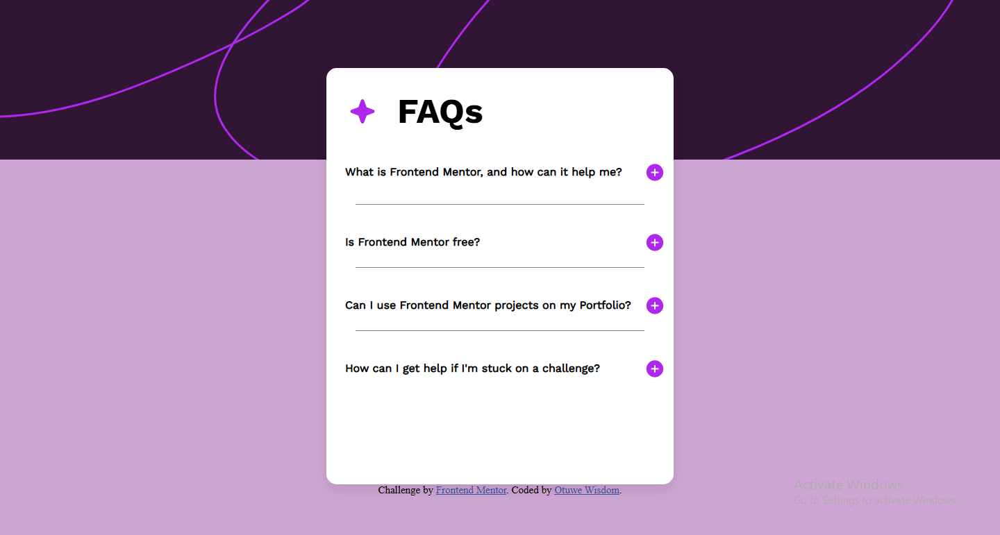

# Frontend Mentor - FAQ accordion solution

This is a solution to the [FAQ accordion challenge on Frontend Mentor](https://www.frontendmentor.io/challenges/faq-accordion-wyfFdeBwBz). Frontend Mentor challenges help you improve your coding skills by building realistic projects. 

## Table of contents

- [Overview](#overview)
  - [The challenge](#the-challenge)
  - [Screenshot](#screenshot)
  - [Links](#links)
- [My process](#my-process)
  - [Built with](#built-with)
  - [What I learned](#what-i-learned)
  - [Continued development](#continued-development)
  - [Useful resources](#useful-resources)
- [Author](#author)
- [Acknowledgments](#acknowledgments)


## Overview

### The challenge

Users should be able to:

- Hide/Show the answer to a question when the question is clicked
- Navigate the questions and hide/show answers using keyboard navigation alone
- View the optimal layout for the interface depending on their device's screen size
- See hover and focus states for all interactive elements on the page

### Screenshot




### Links


- Live Site URL: [Add live site URL here](https://your-live-site-url.com)

## My process

### Built with

- Semantic HTML5 markup
- CSS custom properties
- Flexbox
- CSS Grid
- JavaScript
- EventListeners


### What I learned

I learnt a Lot on how to use eventlisteners, animations, transition and many more 


```css

.first-ans{
    font-weight: 500;
    line-height: 1.3;
    font-family: "MyCustomFont", sans-serif;
    color: grey;
    font-size: 17px;
    transition: max-height 0.3s ease, opacity 0.3s ease-in-out;
    max-height: 0;
    overflow: hidden;
    opacity: 0;
    margin-top: 10px;
}

.first-p{
    font-size: 20px;
}

.faq-items.active .first-open{
    display: none;
}

.faq-items.active .first-close{
    display: inline;
}

.faq-items.active .first-ans{
    max-height: 200px;
    opacity: 1;
}

.faq-items.active .first-p{
    font-size: 21px;
}
```
```js

const change = document.querySelectorAll(".faq-items");

change.forEach((item) => {
  item.addEventListener("click", (e) =>{

    e.stopPropagation();
    
    change.forEach((other) => {
      if (other !== item) {
        other.classList.remove("active");
      }
    });

    item.classList.toggle("active");


    const answer = document.querySelector(".first-ans");
    if(item.classList.contains("active")) {
      answer.classList.toggle("active");
    } else {
      answer.classList.remove("active");
    }
  

  }); 
});
```


### Continued development

I will love to learn more on conditionals in Javascript, Learn more about animations in CSS

## Author
- Frontend Mentor - [@Wizdev0](https://www.frontendmentor.io/profile/Wizdev0)
- Twitter - [@otutech](https://www.twitter.com/otutech)

